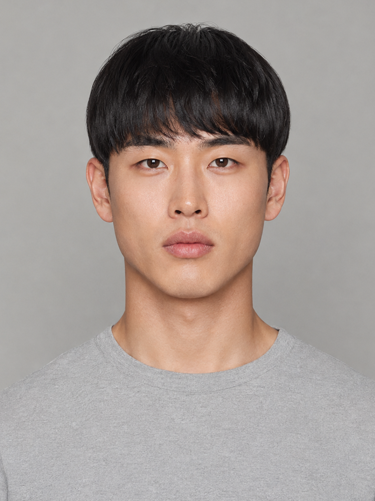
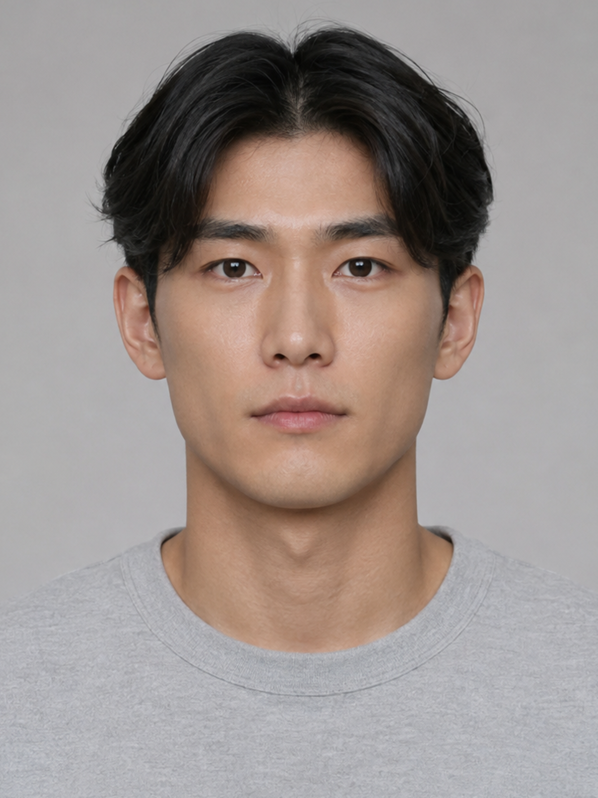
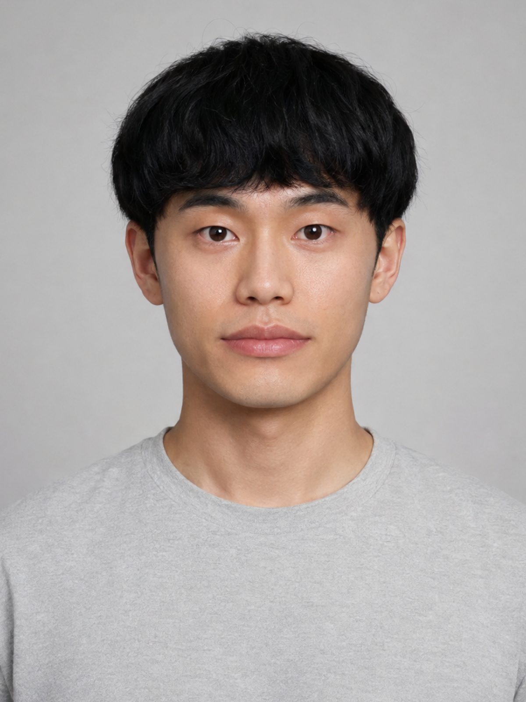
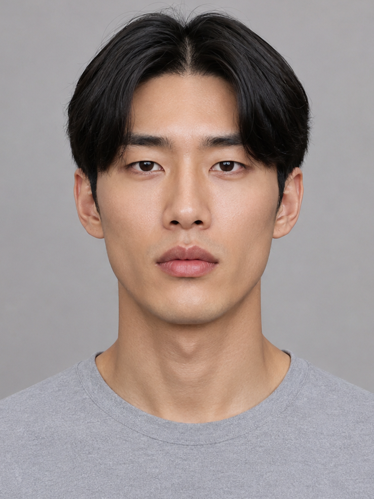
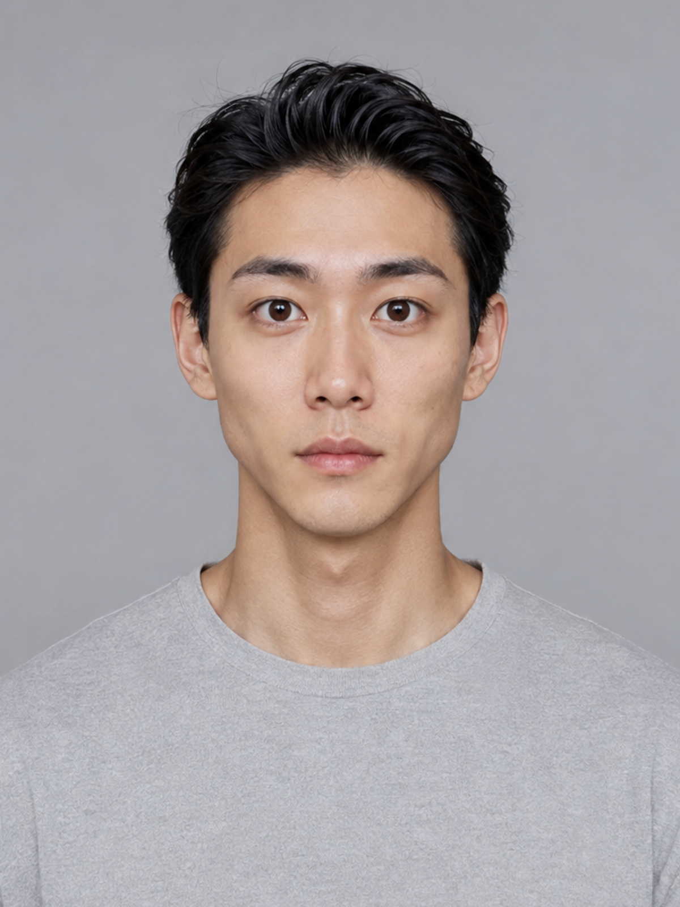
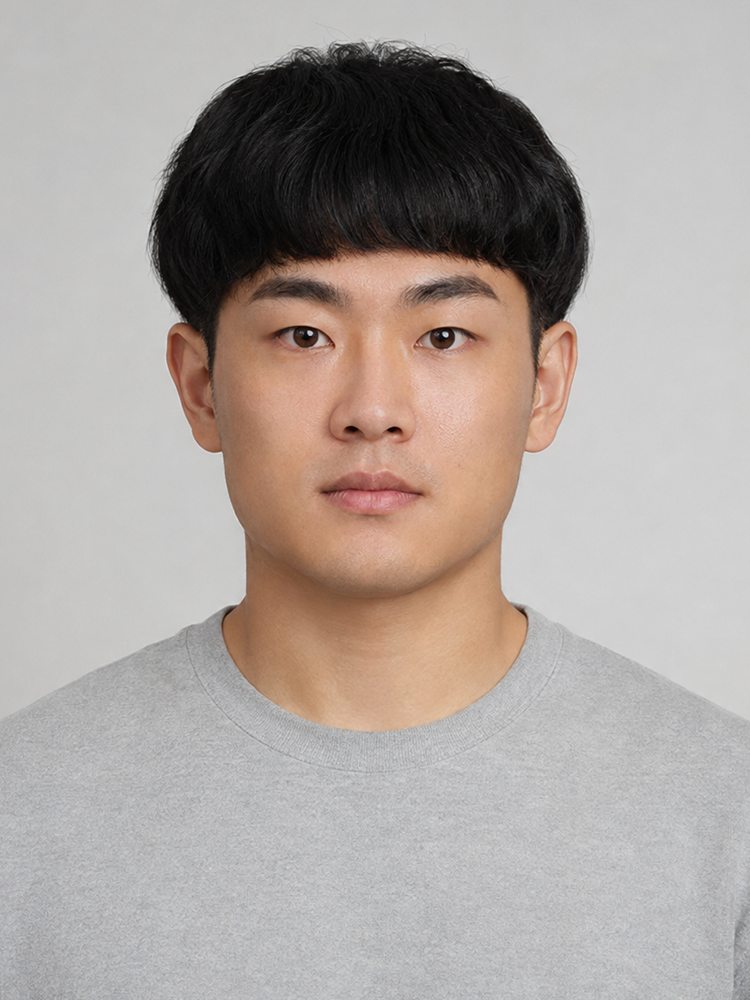
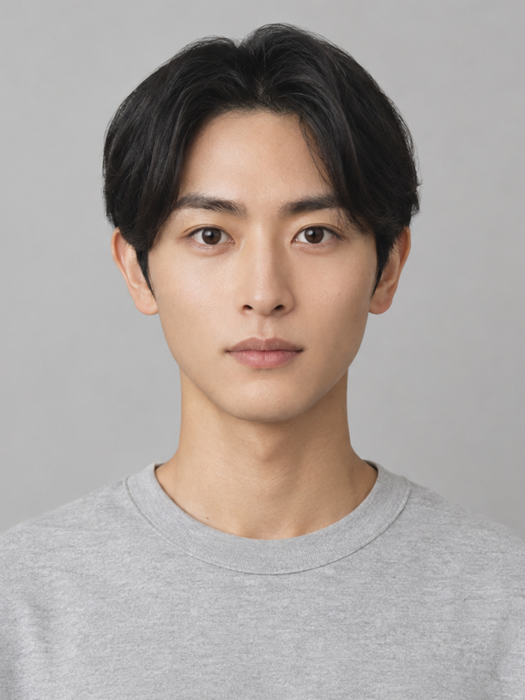
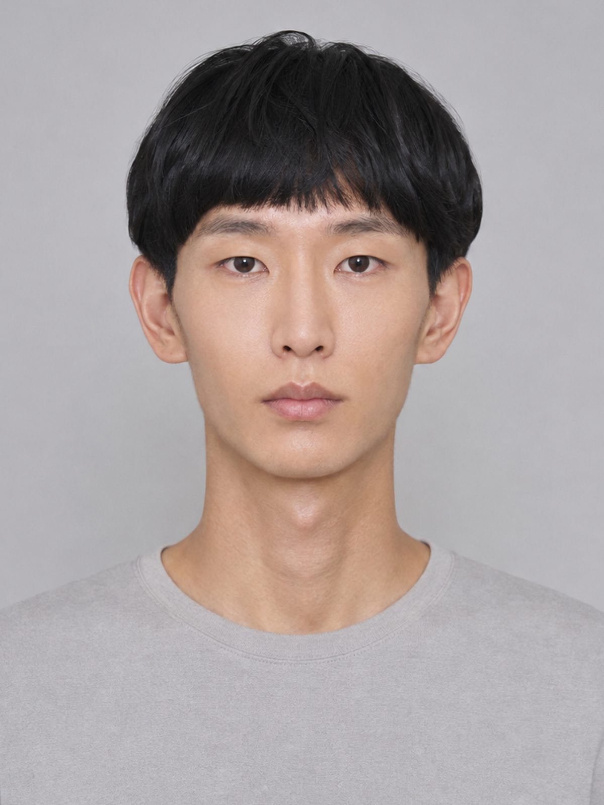
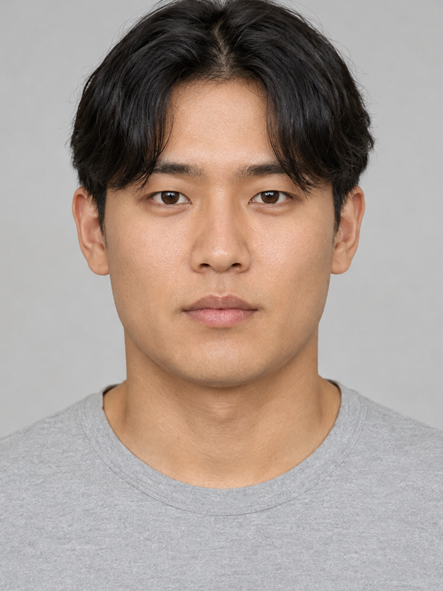

# 男性画像試作 ver3：無作為10人

[10枚を並べた確認ページ](男性画像試作_ver3.html) / [改訂設計書](設計書_ver3.md) / [全40人の特徴量](画像生成用特徴量_男性40人_ver3.md)

男女各40人の特徴量を改訂し、男性40人から10人を抽出して内蔵imagegenで生成した。全員が整った容姿の架空の成人日本人。今回の試作は男性のみで、女性40人は計画とプロンプトまで確定。

## 抽出記録

- 母集団：ID昇順の男性40人。重複なしで10人。seed：`9103096050353372007`。
- 抽出方法：`random.Random(seed).sample(population, 10)`。生成前に抽出を保存し、構成の偏りによる引き直しはしていない。
- 抽出順：male_028, male_032, male_016, male_035, male_029, male_012, male_038, male_033, male_003, male_026。
- 計画SHA-256：`e51b60c3442e9d5b03337b2e4303cd437496e3e14f2bf7f9913f90aec5f00215`。
- [抽出JSON](../data/previews/male_v3_selection.json) / [画像に対応する全特徴量と最終プロンプト](../data/previews/male_faces_v3.js)。

髪型はセンターパート5・マッシュ4・アップバング1。輪郭は長方形3・菱形2・ベース型2・短い卵型1・面長卵型1・逆三角型1。無作為の10人には丸型と通常の卵型は含まれなかったが、40人の計画にはそれぞれ5人いる。

## 生成と確認

- 10人分を生成。口元の差を出すため `male_032` と `male_016` の2人を同じ特徴量・抽出IDで再生成した。生成呼び出しは合計12回、採用10枚。追加指示は対応レコードの `prompt_refinement`、実際の全文は `prompt` に保存。
- 全10枚を既存normalizerで1200×1600へ統一。顔検出成功、画像外の余白補完なし、SHA-256重複なし。全画像パスと試作レコードの1対1対応を確認。
- 目視では輪郭の横幅、目の開き、唇の厚みと長さ、髪型の差を確認。一方、目尻の細かな傾斜・眉・鼻は指定ほど差が出ていない例がある。各人のメモを以下に残す。
- `shape_features` と `tags` は生成目標由来。画像から26項目を実測・校正したデータではないため、試作として別保存。現行診断の画像と採点データは維持。

## 画像一覧

| ID | 試作画像 | 生成目標 | 目視メモ |
| --- | --- | --- | --- |
| male_028 |  | 長方形・アーモンド・つり・唇中間／厚い・マッシュ | 厚い唇と縦に長い輪郭が読み取れる。マッシュの毛先が眉上部に重なるため、眉の太さ・曲率の厳密な採点は要再確認。 |
| male_032 |  | 長方形・細アーモンド・ややつり・唇やや長い／薄い・センターパート | 口元を再生成し、初回より薄い唇が読み取りやすくなった。目の細さと長方形の顎角は指定より穏やか。 |
| male_016 |  | 短い卵型・丸アーモンド・ややつり・唇長い／中間・マッシュ | 口幅を再生成で強調。横に長い口と丸みのある目が確認できる。唇の厚さは中間指定よりやや厚めに見える。 |
| male_035 |  | 長方形・切れ長・やや垂れ・唇やや短い／厚い・センターパート | 切れ長の目と厚い唇が同居している。長方形指定に対して顎先への絞り込みが残る。 |
| male_029 |  | 菱形・丸い・垂れ・唇やや長い／薄い・アップバング | 額出し、丸い目、頬骨から細い顎への輪郭が読み取れる。目尻の垂れと薄い唇は指定より弱め。 |
| male_012 |  | ベース型・丸アーモンド・やや垂れ・唇短い／中間・マッシュ | 幅のある下顎と短めの輪郭、丸みのある目が読み取れる。鼻先は自然な丸み。 |
| male_038 |  | 逆三角型・丸い・ややつり・唇やや短い／薄い・センターパート | 逆三角形の輪郭、丸い目、細い口元の組合せ。目尻の上昇は穏やか。 |
| male_033 |  | 面長卵型・切れ長・ややつり・唇短い／中間・マッシュ | 縦に長い輪郭、細い目、小ぶりな口が読み取れる。眉のアーチは弱く、前髪の近接もある。 |
| male_003 |  | 菱形・丸い・やや垂れ・唇短い／やや薄い・センターパート | 頬骨の幅と細い顎、丸い目と小ぶりな口の組合せ。センターパートの毛先が眉尻付近に重なる。 |
| male_026 |  | ベース型・アーモンド・水平・唇短い／やや厚い・センターパート | 幅のある下顎と丸みのある鼻先、比較的小ぶりな口が読み取れる。唇の厚みは中間に寄っている。 |
